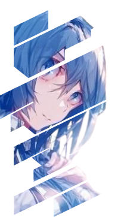

 

 

  
  

   &nbsp;
    
   &nbsp;&#10022; Hi I'm **Kankan Gain**

   &nbsp;&#10022; Currently pursuing an applied bachelor's degree in **Computer Application**

   &nbsp;&#10022; Have good understanding of Web Development

   &nbsp;&#10022; Have understanding in Bengali (native), Hindi (fluent), English (fluent)

   &nbsp;&#10022; My current goals is To become Fullstack Web Developer.
   
   &nbsp;&#10022; Let's talk about Web development, Security, And Anime stuff
   
  

 

      
<h2 align="center">🧑‍💻 Most Used Technologies 🧑‍💻</h2>
 

    
    
    
    
    
    
    
    
    
    
    

<h2></h2>
     

 

  
  

   &nbsp;
   
   &nbsp;
    
   &nbsp;&#10022; Feel free to reach me at: &#10022;

   &nbsp; 
   
   

   &nbsp;&#10022; I ussualy use Discord for chatting with friends.
   
   &nbsp;&#10022; I use Instagram for uploading my drawing content.
   
  

 

